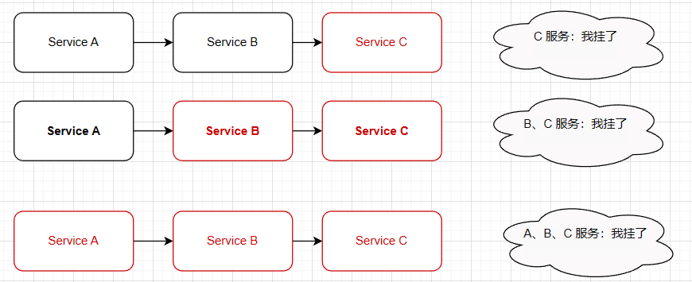
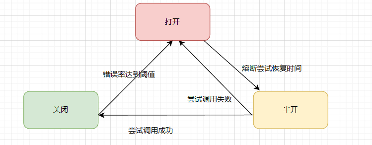

# 网关学习

网关只暴露最外面那层，内部只有程序员自己就可以了


## 配置文件 

配置文件可以根据自己需求要修改

```json
{
  //路由配置  
  "Routes": [
    {
      //下行路径模板 //对程序内的
      "DownstreamPathTemplate": "/api/{url}", //服务地址-url变量
      "DownstreamScheme": "http", //https
      "DownstreamHostAndPorts": [
        {
          "Host": "localhost", //主机
          "Port": 5124 //服务端口
        }
      ],
      "UpstreamPathTemplate": "/api1/{url}", //网关地址--url变量
      "UpstreamHttpMethod": [ "Get", "Post", "Put", "Delete" ] //http请求方式

    }
  ]
}
```

### 负载均衡

```josn
{
  //路由配置  
  "Routes": [
    {
      //下行路径模板 //对程序内的
      "DownstreamPathTemplate": "/api/{url}", //服务地址-url变量
      "DownstreamScheme": "http", //https
      "DownstreamHostAndPorts": [
        {
          "Host": "localhost", //主机
          "Port": 5124 //服务端口
        }, //多级地址
        {
          "Host": "localhost", //主机
          "Port": 5125 //服务端口
        },
        {
          "Host": "localhost", //主机
          "Port": 5126 //服务端口
        }
      ],
      "UpstreamPathTemplate": "/api1/{url}", //网关地址--url变量
      "UpstreamHttpMethod": [ "Get", "Post", "Put", "Delete" ], //http请求方式
      "LoadBalancerOptions": { //负载均衡
        "Type": "RoundRobin" //轮询 //"LeastConnection" 最少连接数的服务器    "CookieStickySessions" 粘性会话 //"NoLoadBalancer" 从配置或服务发现中获取第一个可用服务。 
      }
    }
  ]
}
```

## 缓存

NuGet 

Ocelot.Cache.CacheManager

```c#
builder.Services.AddOcelot()
    .AddCacheManager(x =>
    {
        x.WithDictionaryHandle();
    })
```

最后，为了在路由配置中的路由上使用缓存，请添加此设置。

```json
"FileCacheOptions": { "TtlSeconds": 15, "Region": "somename" }
```

在此示例中，ttl 秒设置为 15，这意味着缓存将在 15 秒后过期。


## 服务治理

### 雪崩效应

从雪崩效应谈**<<服务治理>>**

微服务下，单个服务的故障，而引发系列服务故障，导致大面积宕机怎么办？

两招解决，一是超时，熔断



### 超时机制

调用服务的操作可以配置为执行超时，如果服务未能在这个时间内响应，将回复一个失败消息。

1. nuget Polly
2. AddPolly()
3. 配置文件添加QOS配置
4. 下游超时方法

只是超时等待时间没有结果，不是API返回错误状态。API是正确的

### 熔断机制

使用断路器来检测故障是否得到解决，防止请求反复尝试执行一个可能会失败的操作，从而减少等待纠正故障的时间

QOS并实现

注意

超时是熔断->返回异常不熔断->404也是不熔断

熔断的是服务状态，而不是响应结果



### 限流机制

限制单位时间内请求数，超过就返回指定信息避免错误，降低用户体验保证可用性.

<font color=red>两害相权取基轻，优先于缓存</font>

### 服务降价

在高并发的情况下，防止用户一直等待，使用服降级进行处理为了提高用户体验（自定义消息返回给客户端），防止服务雪崩效应。

超时->熔断->限流->关闭服务->都是属于服务降级，都是为了保障高可用

**能屈能伸，接受不完美**


## Ocelot内置权限

基于Ocelot.Administration 实现管理 ，是管理 网关自己的登录验证主要是配置文件 读取、修改，以及缓存管理

配置：

1 Ocelot.Administration

2 AddAdministration("/administation","secret")


dotnet Dream.Gateway.Ocelot.dll

dotnet Dream.Gateway.Api1.dll

dotnet Dream.Gateway.LoadBalancer.dll

